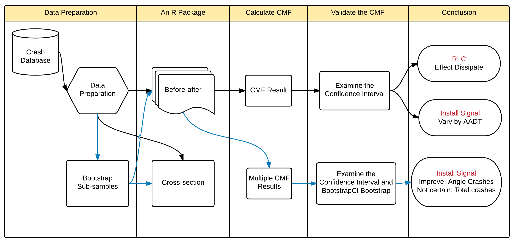

--- 
title: <span style="fontsize:5pt;">COMPREHENSIVE SAFETY ANALYSIS ON CRASH MODIFICATION FACTORS AT INTERSECTIONS </span> 
author: 
- "Presenter: Jung-Han Wang"
- "Supervisor: Mohamed A. Abdel-Aty"
date: March 31, 2016
output:
  revealjs::revealjs_presentation: 
    pandoc_args: [
      "--title-prefix", "3-Minutes Presentation",
      "--id-prefix", "Bar",
    ]
    theme: beige 
    transition: concave
--- 

## Research Diagram



## Thanks for your attention {data-background-video="https://www.dropbox.com/s/vealmhmdyp31ds8/ucfcampus_short.mp4?raw=1"}

```{r, echo=FALSE}
```

